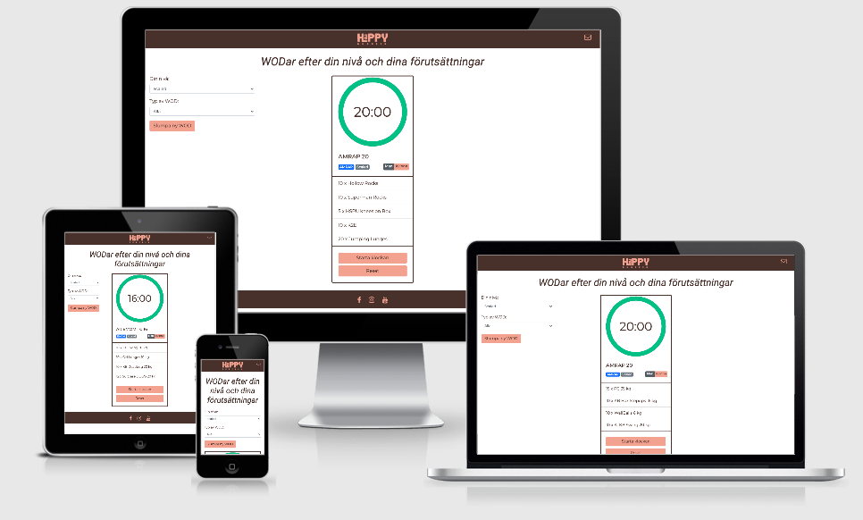

# Happy Burpees WODs

My project is a site for CrossFit practitioners.  It contains a page where you can fill in what type of WOD (exercise) you want to do and on wich level. This will show you a WOD suited for you and let you choose an other WOD if you are not happy with the one suggested for you.
Every WOD also have a timer that count down if you have a WOD you should do within a specific timecap or count up if you want to see for how long the WOD takes to submit for you.

#  #

## UX

- As a CrossFit practitioner you always want to find new WODs to try at home or in the BOX, therefore happy burpees will suggest some good workouts on the site.
- As a CrossFit practitioner you want to adjust the WOD by your gender, therefore you get the option to select if you are a man or a woman.
- As a CrossFit practitioner you want to adjust the WOD by your skills, therefore you get the option to select if your WOD whether should be hard (RX) or easy (scaled).
- As a CrossFit practitioner you want to adjust the WOD by type of WOD, therefore you get the option to select the WOD type (AMRAP, EMOM or RFT).
- As a CrossFit practitioner you want to see the time it takes to go through a WOD, how much time you have to deal with to go through the WOD or how much time that is remaining of the WOD, therefore you see a timer connected to the WOD you have chosen (not applicable for RFT)
- As a CrossFit practitioner I want inspiration and therefore the site have social media links to get you what you want.
- As a CrossFit practitioner you sometimes have questions or suggestions therefore you find Contact information with an e-mail address.

## Features
 
### Existing Features

- Timer count down - If a WOD has a time limit, the timer will display the time in a readable way and start counting down when clicking button.
- Timer count up - If a WOD doesn't have a time limit, the timer will start counting up when clicking button.
- Timer start/stop - When clicking button the timer starts to count (up or down based on WOD-type) so practitioner can start workout. If practioner need a break, the same button will paus/stop the timer.
- Timer reset - allows a practitioner to restart timer.
- Filter and get WOD suggestion - let you fill in what type of WOD you would like to filter by.
- Male/Female (weight) toggle - let you fill in wich gender and get the weights for the WOD based on that.

### Features Left to Implement

- Timer should have 10 seconds countdown when you have pressed the start button to start the WOD.
- Timer should have some kind of alarm or signal based on how much time that have passed or remaining time of the WOD.
- Timer should give you a signal every minute if you have chosed a EMOM WOD.
- The EMOM WOD should highlight the next exercise every minute.
- If the site had WODs with weights based on your 1RP (1 repetition max) there should be at counter connected to the WOD so the weights was based on your individual weights. For example if you should make 10 repetitions on 50% of your 1RM and your 1RM is 100kg it should show you 50kg and so on.

## Technologies Used

- [HTML](https://sv.wikipedia.org/wiki/HTML)
    - For content and structure.
- [CSS](https://sv.wikipedia.org/wiki/Cascading_Style_Sheets)
    - For styling.
- [Bootstrap](https://getbootstrap.com/)
    - For grid-systems and some additional styling.
- [JQuery](https://jquery.com)
    - The project uses **JQuery** to simplify DOM manipulation.
- [API](https://c3kb4h1rub.execute-api.eu-north-1.amazonaws.com/Prod/)
    - Calling API to get WODs.
- [Jasmine](https://jasmine.github.io/)
    - For testing.
- [GitHub](https://github.com/)
    - For version control and hosting.
- [Gitpod](https://gitpod.io/workspaces/)
    - For coding.
- [Fontawsome](https://fontawesome.com/)
    - For icons.
- [Google Fonts](https://fonts.google.com/)
    - For font-families.
- [SmashingLogo](https://smashinglogo.com/sv/)
    - To create the HappyBurpees logo.
- [Coolors](https://coolors.co/e8a28b-46322c-ffffff-fbeeea-e8a28b)
    - For setting the color-scheme.

## Testing

Timer functions are tested by using jasmine.

- Test spec files are named as the corresponding js-file, timer.spec.js.
- Test suites are named after functions tested.
- Test functions are using format "given, when, then".
- UI-components are added as hidden elements in /testrunner/index.html which makes it possible to test UI-components values and behaviour.

Run tests by following link:
https://hanna-maja.github.io/MS2/testrunner/

## Manually Testing

1. As a CrossFit practitioner you always want to find new WODs to try at home or in the BOX, therefore happy burpees will suggest some good workouts on the site.
    1. Go to Happy Burpees Wods
    2. Find a suggested WOD in the middle of the page
    3. Click the button "slumpa ny WOD" if you want to check out an other suggestion

2. As a CrossFit practitioner you want to adjust the WOD by your gender, therefore you get the option to select if you are a man or a woman.
    1. Go to Happy Burpees Wods
    2. Click on the "man" or "kvinna" button on the card
    3. Find a WOD suggested WOD for you that the weights are filtred by gender

3. As a CrossFit practitioner you want to adjust the WOD by your skills, therefore you get the option to select if your WOD whether should be hard (RX) or easy (scaled).
    1. Go to Happy Burpees Wods
    2. Click on the drop down meny "Din nivå"
    3. Choose whether your WOD are filtred by RX or Scaled
    4. See the WOD filtred and suggested for you

4. As a CrossFit practitioner you want to adjust the WOD by type of WOD, therefore you get the option to select the WOD type (AMRAP, EMOM or RFT).
    1. Go to Happy Burpees Wods
    2. Click on the drop down meny "Typ av WOD"
    3. Choose the type of WOD you want to do, an AMRAP, EMOM or RFT
    4. See the WOD filtred and suggested based on your choice

5. As a CrossFit practitioner you want to see the time it takes to go through a WOD, how much time you have to deal with to go through the WOD or how much time that is remaining of the WOD, therefore you see a timer connected to the WOD you have chosen (not applicable for RFT)
    1. Go to Happy Burpees Wods
    2. Chose one WOD you want to do
    3. Find the timer on the top of the WOD
    4. Start the timer by clicking the button "Starta klockan"

6. As a CrossFit practitioner I want inspiration and therefore the site have social media links to get you what you want.
    1. Go to the footer on the page
    2. Click on any of the links that takes you to facebook, instagram or youtube
    3. Veriify that the links takes you to the social media you chosed

7. As a CrossFit practitioner you sometimes have questions or suggestions therefore you find Contact information with an e-mail address.
    1. Go to the top left on the page
    2. Click on the mail-icon
    3. Verify that your e-mail client opens up with contact@happyburpees.se as the receiver

## Bugs Found

Comment from my mentor was that the timer had some time delay and he was able to click the start button before the time was set. This is probably due to a delay from API call.
To solve this problem I could have added a spinner.

## Deployment

To deploy the GitHub repository to GitHub pages the following steps were done:

- Select Settings at the top of the page.
- Scroll down to the GitHub Pages section.
- Under "GitHub Pages" in the Source section, click the dropdown menu labelled 'None' and select 'master'.
- Click "save".
- Scroll back down to the GitHub Pages section and click the link to your website.

## Credits

### Personal
- Thanks to my husband that made the API for this website so I could go through with my ide of a page like this! He has also supported me when I have been stucked and helped me with tons of stupid questions!
- I also want to say "Thank you" to my supporting mentor Dick Vlaanderen during this project.

### Code
- (https://hanna-maja.github.io/MI1/wodar.html)
    - Started this project based on one page fron my first MileStoneProject. My first through was to have this site as a part of my MI1, but decided to let it be a one page site after discussing this with my mentor.
- (https://css-tricks.com/how-to-create-an-animated-countdown-timer-with-html-css-and-javascript/)
    - Timer used and manipulated in my project.